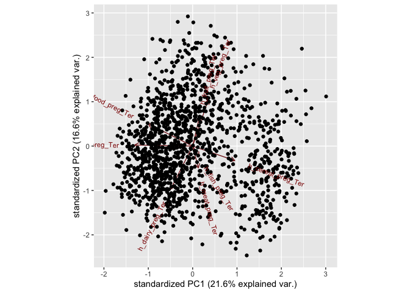

final\_project
================
Rachel Tao
4/14/2021

The following is adapted from my final project for the course,
Introduction to Machine Learning for Epidemiology, which I took in
spring 2021 as part of my Master of Public Health. For this analysis, a
synthetic dataset from the Exposome Data Challenge Event of the Helix
Project (<https://www.isglobal.org/-/exposome-data-analysis-challenge>)
was used. I constructed research questions that could be answerd using
these data. For Part 1, I performed an unsupervised analysis and for
Part 2, I performed a supervised analysis.

## Load libraries and data

``` r
library(tidyverse)
```

    ## ── Attaching packages ─────────────────────────────────────── tidyverse 1.3.1 ──

    ## ✓ ggplot2 3.3.5     ✓ purrr   0.3.4
    ## ✓ tibble  3.1.5     ✓ dplyr   1.0.6
    ## ✓ tidyr   1.1.3     ✓ stringr 1.4.0
    ## ✓ readr   1.4.0     ✓ forcats 0.5.1

    ## ── Conflicts ────────────────────────────────────────── tidyverse_conflicts() ──
    ## x dplyr::filter() masks stats::filter()
    ## x dplyr::lag()    masks stats::lag()

``` r
library(caret)
```

    ## Loading required package: lattice

    ## 
    ## Attaching package: 'caret'

    ## The following object is masked from 'package:purrr':
    ## 
    ##     lift

``` r
library(rpart)
library(rpart.plot)
library(ggplot2)
library(ggcorrplot)
library(gplots)
```

    ## 
    ## Attaching package: 'gplots'

    ## The following object is masked from 'package:stats':
    ## 
    ##     lowess

``` r
library(GGally)
```

    ## Registered S3 method overwritten by 'GGally':
    ##   method from   
    ##   +.gg   ggplot2

``` r
library(stats)
library(factoextra)
```

    ## Welcome! Want to learn more? See two factoextra-related books at https://goo.gl/ve3WBa

``` r
library(devtools)
```

    ## Loading required package: usethis

``` r
install_github("vqv/ggbiplot")
```

    ## Skipping install of 'ggbiplot' from a github remote, the SHA1 (7325e880) has not changed since last install.
    ##   Use `force = TRUE` to force installation

``` r
library(ggbiplot)
```

    ## Loading required package: plyr

    ## ------------------------------------------------------------------------------

    ## You have loaded plyr after dplyr - this is likely to cause problems.
    ## If you need functions from both plyr and dplyr, please load plyr first, then dplyr:
    ## library(plyr); library(dplyr)

    ## ------------------------------------------------------------------------------

    ## 
    ## Attaching package: 'plyr'

    ## The following objects are masked from 'package:dplyr':
    ## 
    ##     arrange, count, desc, failwith, id, mutate, rename, summarise,
    ##     summarize

    ## The following object is masked from 'package:purrr':
    ## 
    ##     compact

    ## Loading required package: scales

    ## 
    ## Attaching package: 'scales'

    ## The following object is masked from 'package:purrr':
    ## 
    ##     discard

    ## The following object is masked from 'package:readr':
    ## 
    ##     col_factor

    ## Loading required package: grid

``` r
library(randomForest)
```

    ## randomForest 4.6-14

    ## Type rfNews() to see new features/changes/bug fixes.

    ## 
    ## Attaching package: 'randomForest'

    ## The following object is masked from 'package:dplyr':
    ## 
    ##     combine

    ## The following object is masked from 'package:ggplot2':
    ## 
    ##     margin

``` r
library(kernlab)
```

    ## 
    ## Attaching package: 'kernlab'

    ## The following object is masked from 'package:scales':
    ## 
    ##     alpha

    ## The following object is masked from 'package:purrr':
    ## 
    ##     cross

    ## The following object is masked from 'package:ggplot2':
    ## 
    ##     alpha

``` r
load("./data/exposome.RData")

studydata <- 
  merge(exposome, phenotype, by = "ID") %>% 
  merge(covariates, by = "ID") %>% 
  as_tibble()
```

## Explore Data

``` r
#view(codebook)

# there is a mix of categorical and continuous variables, categorical variables
# are factors

summary(studydata)
```

    ##        ID       h_abs_ratio_preg_Log h_no2_ratio_preg_Log
    ##  Min.   :   1   Min.   :-0.47756     Min.   :2.105       
    ##  1st Qu.: 326   1st Qu.: 0.09776     1st Qu.:2.670       
    ##  Median : 651   Median : 0.30203     Median :2.963       
    ##  Mean   : 651   Mean   : 0.39089     Mean   :3.004       
    ##  3rd Qu.: 976   3rd Qu.: 0.72516     3rd Qu.:3.298       
    ##  Max.   :1301   Max.   : 1.70921     Max.   :4.525       
    ##                                                          
    ##  h_pm10_ratio_preg_None h_pm25_ratio_preg_None hs_no2_dy_hs_h_Log
    ##  Min.   : 8.066         Min.   : 6.957         Min.   :0.3797    
    ##  1st Qu.:17.535         1st Qu.:13.289         1st Qu.:2.2867    
    ##  Median :23.018         Median :14.879         Median :2.9618    
    ##  Mean   :23.504         Mean   :15.028         Mean   :2.8307    
    ##  3rd Qu.:27.677         3rd Qu.:16.999         3rd Qu.:3.4474    
    ##  Max.   :47.698         Max.   :22.238         Max.   :5.1849    
    ##                                                                  
    ##  hs_no2_wk_hs_h_Log hs_no2_yr_hs_h_Log hs_pm10_dy_hs_h_None
    ##  Min.   :0.9523     Min.   :0.6185     Min.   :  2.916     
    ##  1st Qu.:2.3313     1st Qu.:2.3800     1st Qu.: 17.818     
    ##  Median :2.9806     Median :3.0238     Median : 22.899     
    ##  Mean   :2.8638     Mean   :2.8975     Mean   : 26.214     
    ##  3rd Qu.:3.3932     3rd Qu.:3.4085     3rd Qu.: 30.937     
    ##  Max.   :4.8047     Max.   :4.4225     Max.   :157.397     
    ##                                                            
    ##  hs_pm10_wk_hs_h_None hs_pm10_yr_hs_h_None hs_pm25_dy_hs_h_None
    ##  Min.   :  5.838      Min.   :11.50        Min.   : 1.518      
    ##  1st Qu.: 19.142      1st Qu.:21.68        1st Qu.: 7.950      
    ##  Median : 24.891      Median :24.75        Median :12.244      
    ##  Mean   : 26.409      Mean   :25.10        Mean   :12.897      
    ##  3rd Qu.: 32.131      3rd Qu.:31.26        3rd Qu.:16.263      
    ##  Max.   :211.297      Max.   :46.82        Max.   :58.884      
    ##                                                                
    ##  hs_pm25_wk_hs_h_None hs_pm25_yr_hs_h_None hs_pm25abs_dy_hs_h_Log
    ##  Min.   : 3.139       Min.   : 4.829       Min.   :-1.78220      
    ##  1st Qu.: 9.340       1st Qu.:10.410       1st Qu.:-0.25857      
    ##  Median :12.702       Median :13.110       Median : 0.02163      
    ##  Mean   :13.153       Mean   :12.916       Mean   : 0.11514      
    ##  3rd Qu.:16.152       3rd Qu.:15.122       3rd Qu.: 0.54459      
    ##  Max.   :75.093       Max.   :21.917       Max.   : 2.26537      
    ##                                                                  
    ##  hs_pm25abs_wk_hs_h_Log hs_pm25abs_yr_hs_h_Log h_accesslines300_preg_dic0
    ##  Min.   :-1.03415       Min.   :-0.59670       Min.   :0.0000            
    ##  1st Qu.:-0.13869       1st Qu.:-0.01657       1st Qu.:0.0000            
    ##  Median : 0.04672       Median : 0.17773       Median :0.0000            
    ##  Mean   : 0.16413       Mean   : 0.18058       Mean   :0.1991            
    ##  3rd Qu.: 0.53700       3rd Qu.: 0.31331       3rd Qu.:0.0000            
    ##  Max.   : 1.87776       Max.   : 1.36495       Max.   :1.0000            
    ##                                                                          
    ##  h_accesspoints300_preg_Log h_builtdens300_preg_Sqrt h_connind300_preg_Sqrt
    ##  Min.   :1.270              Min.   : 11.02           Min.   : 1.887        
    ##  1st Qu.:1.963              1st Qu.:340.04           1st Qu.: 9.983        
    ##  Median :2.879              Median :401.49           Median :12.935        
    ##  Mean   :2.670              Mean   :417.06           Mean   :12.737        
    ##  3rd Qu.:3.349              3rd Qu.:502.97           3rd Qu.:15.898        
    ##  Max.   :4.528              Max.   :807.57           Max.   :27.276        
    ##                                                                            
    ##  h_fdensity300_preg_Log h_frichness300_preg_None h_landuseshan300_preg_None
    ##  Min.   :10.26          Min.   :0.00000          Min.   :0.0000            
    ##  1st Qu.:10.26          1st Qu.:0.00000          1st Qu.:0.3408            
    ##  Median :11.36          Median :0.03509          Median :0.4232            
    ##  Mean   :11.61          Mean   :0.06605          Mean   :0.4213            
    ##  3rd Qu.:12.83          3rd Qu.:0.12281          3rd Qu.:0.5070            
    ##  Max.   :15.60          Max.   :0.42105          Max.   :1.0000            
    ##                                                                            
    ##  h_popdens_preg_Sqrt h_walkability_mean_preg_None hs_accesslines300_h_dic0
    ##  Min.   :  0.00      Min.   :0.1000               Min.   :0.0000          
    ##  1st Qu.: 53.79      1st Qu.:0.2000               1st Qu.:0.0000          
    ##  Median : 74.98      Median :0.2500               Median :0.0000          
    ##  Mean   : 77.02      Mean   :0.2674               Mean   :0.1852          
    ##  3rd Qu.: 96.21      3rd Qu.:0.3250               3rd Qu.:0.0000          
    ##  Max.   :261.50      Max.   :0.6250               Max.   :1.0000          
    ##                                                                           
    ##  hs_accesspoints300_h_Log hs_builtdens300_h_Sqrt hs_connind300_h_Log
    ##  Min.   :0.5771           Min.   : 20.3          Min.   :1.270      
    ##  1st Qu.:1.6753           1st Qu.:300.4          1st Qu.:4.405      
    ##  Median :2.7738           Median :375.5          Median :4.959      
    ##  Mean   :2.4051           Mean   :381.1          Mean   :4.776      
    ##  3rd Qu.:3.2846           3rd Qu.:459.1          3rd Qu.:5.364      
    ##  Max.   :4.5838           Max.   :805.8          Max.   :6.617      
    ##                                                                     
    ##  hs_fdensity300_h_Log hs_landuseshan300_h_None hs_popdens_h_Sqrt
    ##  Min.   :10.26        Min.   :0.0000           Min.   :  1.732  
    ##  1st Qu.:10.26        1st Qu.:0.3138           1st Qu.: 30.036  
    ##  Median :10.96        Median :0.4028           Median : 67.405  
    ##  Mean   :11.38        Mean   :0.3970           Mean   : 67.652  
    ##  3rd Qu.:12.34        3rd Qu.:0.4929           3rd Qu.: 84.988  
    ##  Max.   :14.98        Max.   :0.6619           Max.   :261.500  
    ##                                                                 
    ##  hs_walkability_mean_h_None hs_accesslines300_s_dic0 hs_accesspoints300_s_Log
    ##  Min.   :0.100              Min.   :0.0000           Min.   :0.5771          
    ##  1st Qu.:0.275              1st Qu.:0.0000           1st Qu.:1.6753          
    ##  Median :0.300              Median :0.0000           Median :2.5225          
    ##  Mean   :0.326              Mean   :0.1883           Mean   :2.3902          
    ##  3rd Qu.:0.375              3rd Qu.:0.0000           3rd Qu.:3.2846          
    ##  Max.   :0.600              Max.   :1.0000           Max.   :4.0730          
    ##                                                                              
    ##  hs_builtdens300_s_Sqrt hs_connind300_s_Log hs_fdensity300_s_Log
    ##  Min.   :  6.432        Min.   :1.270       Min.   :10.26       
    ##  1st Qu.:314.349        1st Qu.:4.528       1st Qu.:10.26       
    ##  Median :380.503        Median :4.933       Median :11.36       
    ##  Mean   :400.029        Mean   :4.791       Mean   :11.56       
    ##  3rd Qu.:480.133        3rd Qu.:5.364       3rd Qu.:12.57       
    ##  Max.   :805.140        Max.   :6.578       Max.   :15.25       
    ##                                                                 
    ##  hs_landuseshan300_s_None hs_popdens_s_Sqrt h_Absorbance_Log  
    ##  Min.   :0.08298          Min.   :  0.00    Min.   :-0.92737  
    ##  1st Qu.:0.34004          1st Qu.: 38.56    1st Qu.:-0.54273  
    ##  Median :0.44793          Median : 69.26    Median :-0.26937  
    ##  Mean   :0.42993          Mean   : 68.10    Mean   :-0.16919  
    ##  3rd Qu.:0.53689          3rd Qu.: 84.99    3rd Qu.: 0.02422  
    ##  Max.   :0.72770          Max.   :210.95    Max.   : 3.40474  
    ##                                                               
    ##  h_Benzene_Log       h_NO2_Log        h_PM_Log       h_TEX_Log    
    ##  Min.   :-0.3296   Min.   :1.573   Min.   :1.549   Min.   :1.926  
    ##  1st Qu.: 0.3141   1st Qu.:2.979   1st Qu.:2.069   1st Qu.:2.601  
    ##  Median : 0.5600   Median :3.617   Median :2.304   Median :2.976  
    ##  Mean   : 0.5987   Mean   :3.833   Mean   :2.443   Mean   :2.999  
    ##  3rd Qu.: 0.8437   3rd Qu.:4.576   3rd Qu.:2.699   3rd Qu.:3.363  
    ##  Max.   : 1.9975   Max.   :7.093   Max.   :5.236   Max.   :4.944  
    ##                                                                   
    ##  e3_alcpreg_yn_None      h_bfdur_Ter   h_cereal_preg_Ter    h_dairy_preg_Ter
    ##  0:896              (0,10.8]   :506   (0,9]     :531     (0,17.1]   :270    
    ##  1:405              (10.8,34.9]:270   (9,27.3]  :459     (17.1,27.1]:380    
    ##                     (34.9,Inf] :525   (27.3,Inf]:311     (27.1,Inf] :651    
    ##                                                                             
    ##                                                                             
    ##                                                                             
    ##                                                                             
    ##   h_fastfood_preg_Ter  h_fish_preg_Ter h_folic_t1_None   h_fruit_preg_Ter
    ##  (0,0.25]   : 94      (0,1.9]  :343    0:606           (0,0.6]   :  6    
    ##  (0.25,0.83]:535      (1.9,4.1]:490    1:695           (0.6,18.2]:922    
    ##  (0.83,Inf] :672      (4.1,Inf]:468                    (18.2,Inf]:373    
    ##                                                                          
    ##                                                                          
    ##                                                                          
    ##                                                                          
    ##  h_legume_preg_Ter h_meat_preg_Ter   h_pamod_t3_None h_pavig_t3_None
    ##  (0,0.5]:245       (0,6.5] :427    None      : 42    High  : 47     
    ##  (0.5,2]:269       (6.5,10]:387    Often     :474    Low   :952     
    ##  (2,Inf]:787       (10,Inf]:487    Sometimes :191    Medium:302     
    ##                                    Very Often:594                   
    ##                                                                     
    ##                                                                     
    ##                                                                     
    ##     h_veg_preg_Ter hs_bakery_prod_Ter  hs_beverages_Ter  hs_break_cer_Ter
    ##  (0,8.8]   :539    (0,2]  :345        (0,0.132]:331     (0,1.1]  :291    
    ##  (8.8,16.5]:470    (2,6]  :423        (0.132,1]:454     (1.1,5.5]:521    
    ##  (16.5,Inf]:292    (6,Inf]:533        (1,Inf]  :516     (5.5,Inf]:489    
    ##                                                                          
    ##                                                                          
    ##                                                                          
    ##                                                                          
    ##    hs_caff_drink_Ter      hs_dairy_Ter    hs_fastfood_Ter hs_KIDMED_None  
    ##  (0,0.132]  :808     (0,14.6]   :359   (0,0.132]  :143    Min.   :-3.000  
    ##  (0.132,Inf]:493     (14.6,25.6]:465   (0.132,0.5]:603    1st Qu.: 2.000  
    ##                      (25.6,Inf] :477   (0.5,Inf]  :555    Median : 3.000  
    ##                                                           Mean   : 2.881  
    ##                                                           3rd Qu.: 4.000  
    ##                                                           Max.   : 9.000  
    ##                                                                           
    ##  hs_mvpa_prd_alt_None  hs_org_food_Ter hs_pet_cat_r2_None hs_pet_dog_r2_None
    ##  Min.   :-27.76       (0,0.132]:429    0:1059             0:1108            
    ##  1st Qu.: 23.27       (0.132,1]:396    1: 242             1: 193            
    ##  Median : 34.71       (1,Inf]  :476                                         
    ##  Mean   : 37.87                                                             
    ##  3rd Qu.: 47.75                                                             
    ##  Max.   :146.75                                                             
    ##                                                                             
    ##  hs_pet_None hs_proc_meat_Ter    hs_readymade_Ter hs_sd_wk_None    
    ##  No :807     (0,1.5]:366      (0,0.132]  :327     Min.   :  3.143  
    ##  Yes:494     (1.5,4]:471      (0.132,0.5]:296     1st Qu.:155.714  
    ##              (4,Inf]:464      (0.5,Inf]  :678     Median :210.000  
    ##                                                   Mean   :235.809  
    ##                                                   3rd Qu.:282.857  
    ##                                                   Max.   :994.286  
    ##                                                                    
    ##   hs_total_bread_Ter  hs_total_cereal_Ter hs_total_fish_Ter hs_total_fruits_Ter
    ##  (0,7]     :431      (0,14.1]   :418      (0,1.5]:389       (0,7]     :413     
    ##  (7,17.5]  :381      (14.1,23.6]:442      (1.5,3]:454       (7,14.1]  :407     
    ##  (17.5,Inf]:489      (23.6,Inf] :441      (3,Inf]:458       (14.1,Inf]:481     
    ##                                                                                
    ##                                                                                
    ##                                                                                
    ##                                                                                
    ##  hs_total_lipids_Ter hs_total_meat_Ter hs_total_potatoes_Ter
    ##  (0,3]  :397         (0,6]  :425       (0,3]  :417          
    ##  (3,7]  :403         (6,9]  :411       (3,4]  :405          
    ##  (7,Inf]:501         (9,Inf]:465       (4,Inf]:479          
    ##                                                             
    ##                                                             
    ##                                                             
    ##                                                             
    ##  hs_total_sweets_Ter  hs_total_veg_Ter  hs_total_yog_Ter
    ##  (0,4.1]  :344       (0,6]    :404     (0,6]    :779    
    ##  (4.1,8.5]:516       (6,8.5]  :314     (6,8.5]  :308    
    ##  (8.5,Inf]:441       (8.5,Inf]:583     (8.5,Inf]:214    
    ##                                                         
    ##                                                         
    ##                                                         
    ##                                                         
    ##  hs_dif_hours_total_None  hs_as_c_Log2       hs_as_m_Log2      hs_cd_c_Log2    
    ##  Min.   : 7.901          Min.   :-15.0124   Min.   :-38.625   Min.   :-10.395  
    ##  1st Qu.: 9.794          1st Qu.: -4.0075   1st Qu.: -5.419   1st Qu.: -4.399  
    ##  Median :10.330          Median :  0.4854   Median : -1.925   Median : -3.818  
    ##  Mean   :10.296          Mean   : -0.9947   Mean   : -3.011   Mean   : -3.969  
    ##  3rd Qu.:10.741          3rd Qu.:  1.2630   3rd Qu.:  1.007   3rd Qu.: -3.393  
    ##  Max.   :12.852          Max.   :  4.8227   Max.   :  6.493   Max.   :  0.840  
    ##                                                                                
    ##   hs_cd_m_Log2     hs_co_c_Log2     hs_co_m_Log2     hs_cs_c_Log2     
    ##  Min.   :-7.844   Min.   :-5.546   Min.   :-5.184   Min.   :-1.45403  
    ##  1st Qu.:-2.671   1st Qu.:-2.718   1st Qu.:-2.515   1st Qu.: 0.05658  
    ##  Median :-2.427   Median :-2.427   Median :-2.012   Median : 0.46467  
    ##  Mean   :-2.179   Mean   :-2.344   Mean   :-1.694   Mean   : 0.44276  
    ##  3rd Qu.:-1.713   3rd Qu.:-2.041   3rd Qu.:-0.550   3rd Qu.: 0.80735  
    ##  Max.   : 4.802   Max.   : 1.401   Max.   : 2.503   Max.   : 3.06523  
    ##                                                                       
    ##   hs_cs_m_Log2       hs_cu_c_Log2     hs_cu_m_Log2     hs_hg_c_Log2     
    ##  Min.   :-1.15843   Min.   : 9.079   Min.   : 9.036   Min.   :-10.8954  
    ##  1st Qu.: 0.07039   1st Qu.: 9.681   1st Qu.:10.253   1st Qu.: -1.2277  
    ##  Median : 0.40054   Median : 9.828   Median :10.441   Median : -0.1959  
    ##  Mean   : 0.48140   Mean   : 9.828   Mean   :10.402   Mean   : -0.2980  
    ##  3rd Qu.: 0.80736   3rd Qu.: 9.966   3rd Qu.:10.541   3rd Qu.:  0.8237  
    ##  Max.   : 3.44626   Max.   :12.123   Max.   :11.167   Max.   :  3.6554  
    ##                                                                         
    ##   hs_hg_m_Log2      hs_mn_c_Log2    hs_mn_m_Log2    hs_mo_c_Log2     
    ##  Min.   :-9.0230   Min.   :1.705   Min.   :1.655   Min.   :-9.23481  
    ##  1st Qu.:-0.3094   1st Qu.:2.836   1st Qu.:3.291   1st Qu.:-0.76121  
    ##  Median : 0.5753   Median :3.119   Median :3.573   Median :-0.40354  
    ##  Mean   : 0.5698   Mean   :3.128   Mean   :3.542   Mean   :-0.31526  
    ##  3rd Qu.: 1.5705   3rd Qu.:3.392   3rd Qu.:3.807   3rd Qu.: 0.02857  
    ##  Max.   : 5.4429   Max.   :4.792   Max.   :5.446   Max.   : 5.12101  
    ##                                                                      
    ##   hs_mo_m_Log2      hs_pb_c_Log2    hs_pb_m_Log2     hs_tl_cdich_None
    ##  Min.   :-2.7179   Min.   :1.084   Min.   :1.220   Detected  : 102   
    ##  1st Qu.:-0.9828   1st Qu.:2.680   1st Qu.:2.618   Undetected:1199   
    ##  Median :-0.7322   Median :3.103   Median :3.189                     
    ##  Mean   :-0.6933   Mean   :3.108   Mean   :3.211                     
    ##  3rd Qu.:-0.3978   3rd Qu.:3.485   3rd Qu.:3.807                     
    ##  Max.   : 6.1334   Max.   :7.735   Max.   :7.547                     
    ##                                                                      
    ##    hs_tl_mdich_None h_humidity_preg_None h_pressure_preg_None
    ##  Detected  :  17    Min.   :55.83        Min.   : 974.9      
    ##  Undetected:1284    1st Qu.:70.63        1st Qu.: 980.8      
    ##                     Median :77.10        Median : 983.4      
    ##                     Mean   :76.56        Mean   : 991.5      
    ##                     3rd Qu.:86.54        3rd Qu.:1002.3      
    ##                     Max.   :90.67        Max.   :1015.5      
    ##                                                              
    ##  h_temperature_preg_None hs_hum_mt_hs_h_None hs_tm_mt_hs_h_None
    ##  Min.   : 3.120          Min.   :52.05       Min.   :-3.477    
    ##  1st Qu.: 8.127          1st Qu.:64.99       1st Qu.: 6.761    
    ##  Median :10.155          Median :72.89       Median :12.442    
    ##  Mean   :11.195          Mean   :73.91       Mean   :11.611    
    ##  3rd Qu.:13.798          3rd Qu.:82.55       3rd Qu.:16.092    
    ##  Max.   :22.566          Max.   :96.14       Max.   :27.271    
    ##                                                                
    ##  hs_uvdvf_mt_hs_h_None hs_hum_dy_hs_h_None hs_hum_wk_hs_h_None
    ##  Min.   :0.007         Min.   : 26.19      Min.   :48.59      
    ##  1st Qu.:0.259         1st Qu.: 59.15      1st Qu.:63.82      
    ##  Median :1.009         Median : 72.27      Median :73.75      
    ##  Mean   :1.403         Mean   : 72.75      Mean   :74.07      
    ##  3rd Qu.:2.308         3rd Qu.: 85.00      3rd Qu.:84.38      
    ##  Max.   :5.150         Max.   :100.00      Max.   :98.62      
    ##                                                               
    ##  hs_tm_dy_hs_h_None hs_tm_wk_hs_h_None hs_uvdvf_dy_hs_h_None
    ##  Min.   :-7.90      Min.   :-5.605     Min.   :0.000        
    ##  1st Qu.: 6.20      1st Qu.: 6.745     1st Qu.:0.220        
    ##  Median :12.00      Median :12.375     Median :1.030        
    ##  Mean   :11.44      Mean   :11.442     Mean   :1.439        
    ##  3rd Qu.:16.18      3rd Qu.:16.167     3rd Qu.:2.380        
    ##  Max.   :30.70      Max.   :27.688     Max.   :5.550        
    ##                                                             
    ##  hs_uvdvf_wk_hs_h_None hs_blueyn300_s_None h_blueyn300_preg_None
    ##  Min.   :0.001429      0:1208              0:1194               
    ##  1st Qu.:0.234286      1:  93              1: 107               
    ##  Median :1.101429                                               
    ##  Mean   :1.446599                                               
    ##  3rd Qu.:2.407143                                               
    ##  Max.   :5.254286                                               
    ##                                                                 
    ##  h_greenyn300_preg_None h_ndvi100_preg_None hs_greenyn300_s_None
    ##  0:321                  Min.   :0.1062      0: 283              
    ##  1:980                  1st Qu.:0.2488      1:1018              
    ##                         Median :0.4105                          
    ##                         Mean   :0.3917                          
    ##                         3rd Qu.:0.5158                          
    ##                         Max.   :0.7354                          
    ##                                                                 
    ##  hs_blueyn300_h_None hs_greenyn300_h_None hs_ndvi100_h_None hs_ndvi100_s_None
    ##  0:1184              0: 274               Min.   :0.09675   Min.   :0.09519  
    ##  1: 117              1:1027               1st Qu.:0.31847   1st Qu.:0.31576  
    ##                                           Median :0.47907   Median :0.44998  
    ##                                           Mean   :0.45053   Mean   :0.41609  
    ##                                           3rd Qu.:0.57471   3rd Qu.:0.52503  
    ##                                           Max.   :0.81432   Max.   :0.75681  
    ##                                                                              
    ##  h_lden_cat_preg_None hs_ln_cat_h_None hs_lden_cat_s_None hs_dde_cadj_Log2
    ##  Min.   :33.92        1:476            1:580              Min.   : 1.192  
    ##  1st Qu.:50.00        2:633            2:265              1st Qu.: 3.563  
    ##  Median :58.63        3:104            3:299              Median : 4.454  
    ##  Mean   :57.47        4: 61            4:104              Mean   : 4.669  
    ##  3rd Qu.:64.36        5: 27            5: 37              3rd Qu.: 5.509  
    ##  Max.   :77.40                         6: 16              Max.   :11.075  
    ##                                                                           
    ##  hs_dde_madj_Log2  hs_ddt_cadj_Log2   hs_ddt_madj_Log2   hs_hcb_cadj_Log2 
    ##  Min.   : 0.8634   Min.   :-15.4250   Min.   :-14.1418   Min.   :-13.136  
    ##  1st Qu.: 4.4580   1st Qu.: -1.7517   1st Qu.: -0.2646   1st Qu.:  2.650  
    ##  Median : 5.5719   Median : -0.4731   Median :  0.6778   Median :  3.050  
    ##  Mean   : 5.8409   Mean   : -1.5790   Mean   :  0.8748   Mean   :  3.154  
    ##  3rd Qu.: 7.0023   3rd Qu.:  0.7681   3rd Qu.:  1.5125   3rd Qu.:  3.520  
    ##  Max.   :10.8937   Max.   :  7.6305   Max.   :  6.5566   Max.   :  6.461  
    ##                                                                           
    ##  hs_hcb_madj_Log2 hs_pcb118_cadj_Log2 hs_pcb118_madj_Log2 hs_pcb138_cadj_Log2
    ##  Min.   :-9.420   Min.   :-6.9507     Min.   :-1.170      Min.   :-9.432     
    ##  1st Qu.: 2.315   1st Qu.: 0.6038     1st Qu.: 0.627      1st Qu.: 1.744     
    ##  Median : 2.797   Median : 1.0007     Median : 1.052      Median : 2.416     
    ##  Mean   : 2.955   Mean   : 1.1023     Mean   : 1.250      Mean   : 2.402     
    ##  3rd Qu.: 3.486   3rd Qu.: 1.5596     3rd Qu.: 1.829      3rd Qu.: 3.110     
    ##  Max.   : 7.357   Max.   : 4.7829     Max.   : 7.426      Max.   : 7.746     
    ##                                                                              
    ##  hs_pcb138_madj_Log2 hs_pcb153_cadj_Log2 hs_pcb153_madj_Log2
    ##  Min.   :-10.187     Min.   :1.207       Min.   :1.110      
    ##  1st Qu.:  1.788     1st Qu.:2.858       1st Qu.:2.852      
    ##  Median :  2.921     Median :3.519       Median :3.854      
    ##  Mean   :  2.868     Mean   :3.555       Mean   :3.892      
    ##  3rd Qu.:  3.794     3rd Qu.:4.218       3rd Qu.:4.739      
    ##  Max.   :  8.206     Max.   :7.764       Max.   :9.839      
    ##                                                             
    ##  hs_pcb170_cadj_Log2 hs_pcb170_madj_Log2 hs_pcb180_cadj_Log2
    ##  Min.   :-16.8417    Min.   :-2.0418     Min.   :-11.7198   
    ##  1st Qu.: -0.8488    1st Qu.:-0.3211     1st Qu.:  0.6983   
    ##  Median :  0.2765    Median : 0.8727     Median :  1.8340   
    ##  Mean   : -0.3076    Mean   : 1.0875     Mean   :  1.7477   
    ##  3rd Qu.:  1.3909    3rd Qu.: 2.2000     3rd Qu.:  3.0077   
    ##  Max.   :  4.7832    Max.   : 7.7831     Max.   :  5.8781   
    ##                                                             
    ##  hs_pcb180_madj_Log2 hs_sumPCBs5_cadj_Log2 hs_sumPCBs5_madj_Log2
    ##  Min.   :-10.121     Min.   :2.182         Min.   :2.299        
    ##  1st Qu.:  2.069     1st Qu.:3.857         1st Qu.:4.007        
    ##  Median :  2.990     Median :4.612         Median :4.715        
    ##  Mean   :  2.946     Mean   :4.647         Mean   :4.860        
    ##  3rd Qu.:  4.034     3rd Qu.:5.372         3rd Qu.:5.738        
    ##  Max.   :  9.349     Max.   :9.277         Max.   :9.341        
    ##                                                                 
    ##  hs_dep_cadj_Log2   hs_dep_madj_Log2   hs_detp_cadj_Log2  hs_detp_madj_Log2 
    ##  Min.   :-12.5924   Min.   :-13.4083   Min.   :-15.4450   Min.   :-28.3791  
    ##  1st Qu.: -0.9973   1st Qu.:  0.9887   1st Qu.: -5.1816   1st Qu.: -3.9329  
    ##  Median :  0.9287   Median :  1.6631   Median : -3.3437   Median : -0.5251  
    ##  Mean   :  0.1606   Mean   :  1.7010   Mean   : -2.4230   Mean   : -1.5667  
    ##  3rd Qu.:  2.2958   3rd Qu.:  2.6659   3rd Qu.:  0.7957   3rd Qu.:  1.0079  
    ##  Max.   :  9.3767   Max.   :  7.5853   Max.   :  6.2939   Max.   :  5.4700  
    ##                                                                             
    ##  hs_dmdtp_cdich_None hs_dmp_cadj_Log2   hs_dmp_madj_Log2  hs_dmtp_cadj_Log2 
    ##  Detected  : 227     Min.   :-16.6419   Min.   :-17.141   Min.   :-10.6455  
    ##  Undetected:1074     1st Qu.: -4.7344   1st Qu.:  2.011   1st Qu.:  0.3311  
    ##                      Median : -0.2684   Median :  2.796   Median :  1.5927  
    ##                      Mean   : -1.4156   Mean   :  2.243   Mean   :  1.1332  
    ##                      3rd Qu.:  2.2472   3rd Qu.:  3.756   3rd Qu.:  2.7625  
    ##                      Max.   :  6.3794   Max.   :  8.333   Max.   :  8.6635  
    ##                                                                             
    ##  hs_dmtp_madj_Log2 hs_pbde153_cadj_Log2 hs_pbde153_madj_Log2
    ##  Min.   :-15.327   Min.   :-17.631      Min.   :-15.0030    
    ##  1st Qu.:  1.072   1st Qu.: -7.963      1st Qu.: -1.8848    
    ##  Median :  2.225   Median : -2.618      Median : -0.9487    
    ##  Mean   :  1.612   Mean   : -4.525      Mean   : -1.7406    
    ##  3rd Qu.:  3.489   3rd Qu.: -1.246      3rd Qu.: -0.0321    
    ##  Max.   :  7.780   Max.   :  4.045      Max.   :  6.4338    
    ##                                                             
    ##  hs_pbde47_cadj_Log2 hs_pbde47_madj_Log2 hs_pfhxs_c_Log2   hs_pfhxs_m_Log2   
    ##  Min.   :-15.357     Min.   :-11.5808    Min.   :-8.8953   Min.   :-17.8296  
    ##  1st Qu.: -2.729     1st Qu.: -1.7581    1st Qu.:-2.3783   1st Qu.: -1.7277  
    ##  Median : -2.148     Median : -0.9687    Median :-1.4426   Median : -0.9284  
    ##  Mean   : -2.606     Mean   : -0.7793    Mean   :-1.5722   Mean   : -0.9841  
    ##  3rd Qu.: -1.535     3rd Qu.:  0.1183    3rd Qu.:-0.7102   3rd Qu.: -0.1648  
    ##  Max.   :  5.381     Max.   :  5.1183    Max.   : 4.8309   Max.   :  3.7592  
    ##                                                                              
    ##  hs_pfna_c_Log2    hs_pfna_m_Log2      hs_pfoa_c_Log2    hs_pfoa_m_Log2   
    ##  Min.   :-8.1484   Min.   :-10.75405   Min.   :-2.2197   Min.   :-5.4760  
    ##  1st Qu.:-1.7387   1st Qu.: -1.31140   1st Qu.: 0.2453   1st Qu.: 0.4107  
    ##  Median :-1.0643   Median : -0.58631   Median : 0.6274   Median : 1.2007  
    ##  Mean   :-1.0798   Mean   : -0.75352   Mean   : 0.6102   Mean   : 1.0479  
    ##  3rd Qu.:-0.4677   3rd Qu.:  0.09482   3rd Qu.: 0.9507   3rd Qu.: 1.7450  
    ##  Max.   : 2.7178   Max.   :  2.56486   Max.   : 2.7352   Max.   : 4.9836  
    ##                                                                           
    ##  hs_pfos_c_Log2     hs_pfos_m_Log2   hs_pfunda_c_Log2  hs_pfunda_m_Log2   
    ##  Min.   :-10.4131   Min.   :-1.824   Min.   :-11.784   Min.   :-26.21246  
    ##  1st Qu.:  0.3699   1st Qu.: 1.961   1st Qu.: -5.013   1st Qu.: -3.21222  
    ##  Median :  1.0274   Median : 2.649   Median : -4.078   Median : -2.47816  
    ##  Mean   :  0.9700   Mean   : 2.556   Mean   : -4.246   Mean   : -2.65699  
    ##  3rd Qu.:  1.6747   3rd Qu.: 3.213   3rd Qu.: -3.272   3rd Qu.: -1.71446  
    ##  Max.   :  5.0801   Max.   : 5.584   Max.   :  0.593   Max.   : -0.04217  
    ##                                                                           
    ##  hs_bpa_cadj_Log2 hs_bpa_madj_Log2  hs_bupa_cadj_Log2 hs_bupa_madj_Log2
    ##  Min.   :-7.150   Min.   :-11.020   Min.   :-13.940   Min.   :-15.578  
    ##  1st Qu.: 1.270   1st Qu.:  0.292   1st Qu.: -4.385   1st Qu.: -1.341  
    ##  Median : 2.014   Median :  1.146   Median : -3.472   Median :  1.420  
    ##  Mean   : 2.144   Mean   :  1.467   Mean   : -3.532   Mean   :  1.016  
    ##  3rd Qu.: 2.875   3rd Qu.:  2.340   3rd Qu.: -2.574   3rd Qu.:  3.603  
    ##  Max.   : 7.833   Max.   :  6.736   Max.   :  6.597   Max.   :  8.534  
    ##                                                                        
    ##  hs_etpa_cadj_Log2 hs_etpa_madj_Log2 hs_mepa_cadj_Log2 hs_mepa_madj_Log2
    ##  Min.   :-6.0647   Min.   :-12.119   Min.   :-6.907    Min.   :-0.3096  
    ##  1st Qu.:-1.2022   1st Qu.:  1.240   1st Qu.: 1.696    1st Qu.: 5.8817  
    ##  Median :-0.5644   Median :  3.280   Median : 2.672    Median : 7.7170  
    ##  Mean   :-0.1302   Mean   :  3.330   Mean   : 3.394    Mean   : 7.3042  
    ##  3rd Qu.: 0.3723   3rd Qu.:  5.127   3rd Qu.: 4.692    3rd Qu.: 8.6247  
    ##  Max.   :10.9895   Max.   : 12.726   Max.   :14.549    Max.   :15.2601  
    ##                                                                         
    ##  hs_oxbe_cadj_Log2 hs_oxbe_madj_Log2  hs_prpa_cadj_Log2  hs_prpa_madj_Log2
    ##  Min.   :-4.1446   Min.   :-10.5100   Min.   :-12.0208   Min.   :-14.154  
    ##  1st Qu.:-0.1665   1st Qu.:  0.7601   1st Qu.: -4.3879   1st Qu.:  3.754  
    ##  Median : 1.1184   Median :  2.5546   Median : -2.2575   Median :  5.775  
    ##  Mean   : 1.4523   Mean   :  3.0346   Mean   : -1.6065   Mean   :  5.228  
    ##  3rd Qu.: 2.7929   3rd Qu.:  4.7789   3rd Qu.:  0.8151   3rd Qu.:  7.073  
    ##  Max.   :12.9631   Max.   : 13.6480   Max.   : 10.7801   Max.   : 13.605  
    ##                                                                           
    ##  hs_trcs_cadj_Log2 hs_trcs_madj_Log2 hs_mbzp_cadj_Log2 hs_mbzp_madj_Log2
    ##  Min.   :-4.3599   Min.   :-4.8110   Min.   :-0.5586   Min.   :-3.738   
    ##  1st Qu.:-1.6413   1st Qu.: 0.5526   1st Qu.: 1.6442   1st Qu.: 1.861   
    ##  Median :-0.7294   Median : 2.6584   Median : 2.3435   Median : 2.887   
    ##  Mean   :-0.3519   Mean   : 3.4281   Mean   : 2.4435   Mean   : 2.978   
    ##  3rd Qu.: 0.5389   3rd Qu.: 6.5909   3rd Qu.: 3.1093   3rd Qu.: 4.097   
    ##  Max.   : 9.2782   Max.   :10.6909   Max.   : 7.1847   Max.   : 9.304   
    ##                                                                         
    ##  hs_mecpp_cadj_Log2 hs_mecpp_madj_Log2 hs_mehhp_cadj_Log2 hs_mehhp_madj_Log2
    ##  Min.   : 2.631     Min.   : 2.427     Min.   : 1.820     Min.   :-0.4596   
    ##  1st Qu.: 4.412     1st Qu.: 4.327     1st Qu.: 3.644     1st Qu.: 3.4564   
    ##  Median : 5.136     Median : 4.851     Median : 4.350     Median : 4.0677   
    ##  Mean   : 5.190     Mean   : 5.027     Mean   : 4.398     Mean   : 4.1568   
    ##  3rd Qu.: 5.915     3rd Qu.: 5.632     3rd Qu.: 5.050     3rd Qu.: 4.7897   
    ##  Max.   :10.628     Max.   :10.411     Max.   :11.130     Max.   : 9.9176   
    ##                                                                             
    ##  hs_mehp_cadj_Log2 hs_mehp_madj_Log2 hs_meohp_cadj_Log2 hs_meohp_madj_Log2
    ##  Min.   :-1.6330   Min.   :-7.469    Min.   : 1.138     Min.   :-0.0179   
    ##  1st Qu.: 0.8235   1st Qu.: 1.793    1st Qu.: 2.903     1st Qu.: 3.1001   
    ##  Median : 1.5741   Median : 3.057    Median : 3.633     Median : 3.6836   
    ##  Mean   : 1.6142   Mean   : 2.940    Mean   : 3.696     Mean   : 3.7810   
    ##  3rd Qu.: 2.3459   3rd Qu.: 3.808    3rd Qu.: 4.378     3rd Qu.: 4.4199   
    ##  Max.   : 8.1407   Max.   : 8.702    Max.   :10.332     Max.   : 9.6122   
    ##                                                                           
    ##  hs_mep_cadj_Log2 hs_mep_madj_Log2 hs_mibp_cadj_Log2 hs_mibp_madj_Log2
    ##  Min.   : 1.748   Min.   : 3.292   Min.   :2.321     Min.   :0.9264   
    ##  1st Qu.: 4.015   1st Qu.: 6.398   1st Qu.:4.719     1st Qu.:4.5921   
    ##  Median : 5.054   Median : 7.776   Median :5.413     Median :5.3438   
    ##  Mean   : 5.261   Mean   : 7.772   Mean   :5.461     Mean   :5.3105   
    ##  3rd Qu.: 6.257   3rd Qu.: 8.911   3rd Qu.:6.196     3rd Qu.:5.9232   
    ##  Max.   :11.642   Max.   :14.114   Max.   :9.750     Max.   :9.4609   
    ##                                                                       
    ##  hs_mnbp_cadj_Log2 hs_mnbp_madj_Log2 hs_ohminp_cadj_Log2 hs_ohminp_madj_Log2
    ##  Min.   :1.866     Min.   :-0.7106   Min.   :-0.2821     Min.   :-11.4619   
    ##  1st Qu.:3.962     1st Qu.: 4.1958   1st Qu.: 1.7093     1st Qu.: -0.7237   
    ##  Median :4.621     Median : 4.8550   Median : 2.4143     Median : -0.2093   
    ##  Mean   :4.676     Mean   : 4.9574   Mean   : 2.5870     Mean   : -0.2990   
    ##  3rd Qu.:5.304     3rd Qu.: 5.5687   3rd Qu.: 3.1967     3rd Qu.:  0.2665   
    ##  Max.   :8.932     Max.   :12.6539   Max.   : 9.0983     Max.   :  6.0560   
    ##                                                                             
    ##  hs_oxominp_cadj_Log2 hs_oxominp_madj_Log2 hs_sumDEHP_cadj_Log2
    ##  Min.   :-0.9126      Min.   :-11.55154    Min.   : 2.648      
    ##  1st Qu.: 0.8939      1st Qu.: -0.69643    1st Qu.: 5.244      
    ##  Median : 1.4939      Median : -0.01846    Median : 6.004      
    ##  Mean   : 1.6735      Mean   : -0.05541    Mean   : 6.049      
    ##  3rd Qu.: 2.2830      3rd Qu.:  0.51914    3rd Qu.: 6.839      
    ##  Max.   : 9.4093      Max.   :  5.55327    Max.   :10.052      
    ##                                                                
    ##  hs_sumDEHP_madj_Log2 FAS_cat_None        hs_contactfam_3cat_num_None
    ##  Min.   : 3.211       Low   :146   (almost) Daily       :863         
    ##  1st Qu.: 5.226       Middle:486   Once a week          :382         
    ##  Median : 5.880       High  :669   Less than once a week: 56         
    ##  Mean   : 6.015                                                      
    ##  3rd Qu.: 6.697                                                      
    ##  Max.   :11.691                                                      
    ##                                                                      
    ##  hs_hm_pers_None            hs_participation_3cat_None e3_asmokcigd_p_None
    ##  Min.   : 1.000   None                   :748          Min.   : 0.000     
    ##  1st Qu.: 4.000   1 organisation         :355          1st Qu.: 0.000     
    ##  Median : 4.000   2 or more organisations:198          Median : 0.000     
    ##  Mean   : 4.248                                        Mean   : 0.494     
    ##  3rd Qu.: 5.000                                        3rd Qu.: 0.000     
    ##  Max.   :10.000                                        Max.   :15.238     
    ##                                                                           
    ##  hs_cotinine_cdich_None hs_cotinine_mcat_None   hs_globalexp2_None
    ##  Detected  : 223        Non-smokers:759       exposure   :463     
    ##  Undetected:1078        SHS smokers:157       no exposure:838     
    ##                         Smokers    :385                           
    ##                                                                   
    ##                                                                   
    ##                                                                   
    ##                                                                   
    ##  hs_smk_parents_None h_distinvnear1_preg_Log h_trafload_preg_pow1over3
    ##  both   :142         Min.   :-10.022         Min.   :  0.3458         
    ##  neither:814         1st Qu.: -3.980         1st Qu.: 33.6542         
    ##  one    :345         Median : -3.002         Median : 66.6101         
    ##                      Mean   : -3.153         Mean   : 75.5390         
    ##                      3rd Qu.: -2.256         3rd Qu.:113.0812         
    ##                      Max.   :  2.794         Max.   :294.2705         
    ##                                                                       
    ##  h_trafnear_preg_pow1over3 hs_trafload_h_pow1over3 hs_trafnear_h_pow1over3
    ##  Min.   : 0.000            Min.   :  0.00          Min.   : 0.000         
    ##  1st Qu.: 7.937            1st Qu.: 77.42          1st Qu.: 8.434         
    ##  Median :12.119            Median :114.87          Median :14.841         
    ##  Mean   :14.989            Mean   :112.70          Mean   :15.977         
    ##  3rd Qu.:21.397            3rd Qu.:136.00          3rd Qu.:22.104         
    ##  Max.   :39.321            Max.   :293.58          Max.   :49.348         
    ##                                                                           
    ##  h_bro_preg_Log    h_clf_preg_Log    h_thm_preg_Log       e3_bw     
    ##  Min.   :-2.9759   Min.   :-6.9078   Min.   :-1.600   Min.   :1100  
    ##  1st Qu.:-0.5009   1st Qu.:-0.4959   1st Qu.: 1.849   1st Qu.:3080  
    ##  Median : 1.8701   Median : 2.0776   Median : 2.912   Median :3398  
    ##  Mean   : 1.2640   Mean   : 0.9645   Mean   : 2.709   Mean   :3389  
    ##  3rd Qu.: 2.7488   3rd Qu.: 3.1781   3rd Qu.: 3.839   3rd Qu.:3720  
    ##  Max.   : 4.9016   Max.   : 3.8334   Max.   : 5.031   Max.   :5260  
    ##                                                                     
    ##    hs_asthma       hs_zbmi_who      hs_correct_raven   hs_Gen_Tot    
    ##  Min.   :0.0000   Min.   :-3.5800   Min.   : 9.00    Min.   :  0.00  
    ##  1st Qu.:0.0000   1st Qu.:-0.4000   1st Qu.:22.00    1st Qu.: 10.00  
    ##  Median :0.0000   Median : 0.2800   Median :27.00    Median : 20.00  
    ##  Mean   :0.1091   Mean   : 0.4032   Mean   :26.29    Mean   : 24.38  
    ##  3rd Qu.:0.0000   3rd Qu.: 1.1300   3rd Qu.:32.00    3rd Qu.: 33.44  
    ##  Max.   :1.0000   Max.   : 4.7200   Max.   :36.00    Max.   :133.00  
    ##                                                                      
    ##  hs_bmi_c_cat h_cohort e3_sex_None  e3_yearbir_None  h_mbmi_None   
    ##  1: 13        1:202    female:608   2003: 55        Min.   :15.88  
    ##  2:904        2:198    male  :693   2004:107        1st Qu.:21.26  
    ##  3:253        3:224                 2005:241        Median :24.02  
    ##  4:131        4:207                 2006:256        Mean   :25.03  
    ##               5:272                 2007:250        3rd Qu.:27.34  
    ##               6:198                 2008:379        Max.   :51.42  
    ##                                     2009: 13                       
    ##  hs_wgtgain_None  e3_gac_None      h_age_None    h_edumc_None h_native_None
    ##  Min.   : 0.0    Min.   :28.00   Min.   :16.00   1:178        0: 146       
    ##  1st Qu.: 9.0    1st Qu.:38.71   1st Qu.:27.64   2:449        1:  67       
    ##  Median :12.0    Median :40.00   Median :31.00   3:674        2:1088       
    ##  Mean   :13.5    Mean   :39.63   Mean   :30.80                             
    ##  3rd Qu.:18.0    3rd Qu.:40.71   3rd Qu.:34.06                             
    ##  Max.   :55.0    Max.   :44.14   Max.   :43.51                             
    ##                                                                            
    ##  h_parity_None hs_child_age_None hs_c_height_None hs_c_weight_None
    ##  0:601         Min.   : 5.437    Min.   :1.054    Min.   :16.00   
    ##  1:464         1st Qu.: 6.500    1st Qu.:1.209    1st Qu.:22.90   
    ##  2:236         Median : 8.033    Median :1.280    Median :26.90   
    ##                Mean   : 7.976    Mean   :1.291    Mean   :28.52   
    ##                3rd Qu.: 8.920    3rd Qu.:1.365    3rd Qu.:32.70   
    ##                Max.   :12.101    Max.   :1.685    Max.   :71.10   
    ## 

``` r
# there is no missing data

sapply(studydata, function(x) sum(is.na(x))/nrow(studydata))
```

    ##                           ID         h_abs_ratio_preg_Log 
    ##                            0                            0 
    ##         h_no2_ratio_preg_Log       h_pm10_ratio_preg_None 
    ##                            0                            0 
    ##       h_pm25_ratio_preg_None           hs_no2_dy_hs_h_Log 
    ##                            0                            0 
    ##           hs_no2_wk_hs_h_Log           hs_no2_yr_hs_h_Log 
    ##                            0                            0 
    ##         hs_pm10_dy_hs_h_None         hs_pm10_wk_hs_h_None 
    ##                            0                            0 
    ##         hs_pm10_yr_hs_h_None         hs_pm25_dy_hs_h_None 
    ##                            0                            0 
    ##         hs_pm25_wk_hs_h_None         hs_pm25_yr_hs_h_None 
    ##                            0                            0 
    ##       hs_pm25abs_dy_hs_h_Log       hs_pm25abs_wk_hs_h_Log 
    ##                            0                            0 
    ##       hs_pm25abs_yr_hs_h_Log   h_accesslines300_preg_dic0 
    ##                            0                            0 
    ##   h_accesspoints300_preg_Log     h_builtdens300_preg_Sqrt 
    ##                            0                            0 
    ##       h_connind300_preg_Sqrt       h_fdensity300_preg_Log 
    ##                            0                            0 
    ##     h_frichness300_preg_None   h_landuseshan300_preg_None 
    ##                            0                            0 
    ##          h_popdens_preg_Sqrt h_walkability_mean_preg_None 
    ##                            0                            0 
    ##     hs_accesslines300_h_dic0     hs_accesspoints300_h_Log 
    ##                            0                            0 
    ##       hs_builtdens300_h_Sqrt          hs_connind300_h_Log 
    ##                            0                            0 
    ##         hs_fdensity300_h_Log     hs_landuseshan300_h_None 
    ##                            0                            0 
    ##            hs_popdens_h_Sqrt   hs_walkability_mean_h_None 
    ##                            0                            0 
    ##     hs_accesslines300_s_dic0     hs_accesspoints300_s_Log 
    ##                            0                            0 
    ##       hs_builtdens300_s_Sqrt          hs_connind300_s_Log 
    ##                            0                            0 
    ##         hs_fdensity300_s_Log     hs_landuseshan300_s_None 
    ##                            0                            0 
    ##            hs_popdens_s_Sqrt             h_Absorbance_Log 
    ##                            0                            0 
    ##                h_Benzene_Log                    h_NO2_Log 
    ##                            0                            0 
    ##                     h_PM_Log                    h_TEX_Log 
    ##                            0                            0 
    ##           e3_alcpreg_yn_None                  h_bfdur_Ter 
    ##                            0                            0 
    ##            h_cereal_preg_Ter             h_dairy_preg_Ter 
    ##                            0                            0 
    ##          h_fastfood_preg_Ter              h_fish_preg_Ter 
    ##                            0                            0 
    ##              h_folic_t1_None             h_fruit_preg_Ter 
    ##                            0                            0 
    ##            h_legume_preg_Ter              h_meat_preg_Ter 
    ##                            0                            0 
    ##              h_pamod_t3_None              h_pavig_t3_None 
    ##                            0                            0 
    ##               h_veg_preg_Ter           hs_bakery_prod_Ter 
    ##                            0                            0 
    ##             hs_beverages_Ter             hs_break_cer_Ter 
    ##                            0                            0 
    ##            hs_caff_drink_Ter                 hs_dairy_Ter 
    ##                            0                            0 
    ##              hs_fastfood_Ter               hs_KIDMED_None 
    ##                            0                            0 
    ##         hs_mvpa_prd_alt_None              hs_org_food_Ter 
    ##                            0                            0 
    ##           hs_pet_cat_r2_None           hs_pet_dog_r2_None 
    ##                            0                            0 
    ##                  hs_pet_None             hs_proc_meat_Ter 
    ##                            0                            0 
    ##             hs_readymade_Ter                hs_sd_wk_None 
    ##                            0                            0 
    ##           hs_total_bread_Ter          hs_total_cereal_Ter 
    ##                            0                            0 
    ##            hs_total_fish_Ter          hs_total_fruits_Ter 
    ##                            0                            0 
    ##          hs_total_lipids_Ter            hs_total_meat_Ter 
    ##                            0                            0 
    ##        hs_total_potatoes_Ter          hs_total_sweets_Ter 
    ##                            0                            0 
    ##             hs_total_veg_Ter             hs_total_yog_Ter 
    ##                            0                            0 
    ##      hs_dif_hours_total_None                 hs_as_c_Log2 
    ##                            0                            0 
    ##                 hs_as_m_Log2                 hs_cd_c_Log2 
    ##                            0                            0 
    ##                 hs_cd_m_Log2                 hs_co_c_Log2 
    ##                            0                            0 
    ##                 hs_co_m_Log2                 hs_cs_c_Log2 
    ##                            0                            0 
    ##                 hs_cs_m_Log2                 hs_cu_c_Log2 
    ##                            0                            0 
    ##                 hs_cu_m_Log2                 hs_hg_c_Log2 
    ##                            0                            0 
    ##                 hs_hg_m_Log2                 hs_mn_c_Log2 
    ##                            0                            0 
    ##                 hs_mn_m_Log2                 hs_mo_c_Log2 
    ##                            0                            0 
    ##                 hs_mo_m_Log2                 hs_pb_c_Log2 
    ##                            0                            0 
    ##                 hs_pb_m_Log2             hs_tl_cdich_None 
    ##                            0                            0 
    ##             hs_tl_mdich_None         h_humidity_preg_None 
    ##                            0                            0 
    ##         h_pressure_preg_None      h_temperature_preg_None 
    ##                            0                            0 
    ##          hs_hum_mt_hs_h_None           hs_tm_mt_hs_h_None 
    ##                            0                            0 
    ##        hs_uvdvf_mt_hs_h_None          hs_hum_dy_hs_h_None 
    ##                            0                            0 
    ##          hs_hum_wk_hs_h_None           hs_tm_dy_hs_h_None 
    ##                            0                            0 
    ##           hs_tm_wk_hs_h_None        hs_uvdvf_dy_hs_h_None 
    ##                            0                            0 
    ##        hs_uvdvf_wk_hs_h_None          hs_blueyn300_s_None 
    ##                            0                            0 
    ##        h_blueyn300_preg_None       h_greenyn300_preg_None 
    ##                            0                            0 
    ##          h_ndvi100_preg_None         hs_greenyn300_s_None 
    ##                            0                            0 
    ##          hs_blueyn300_h_None         hs_greenyn300_h_None 
    ##                            0                            0 
    ##            hs_ndvi100_h_None            hs_ndvi100_s_None 
    ##                            0                            0 
    ##         h_lden_cat_preg_None             hs_ln_cat_h_None 
    ##                            0                            0 
    ##           hs_lden_cat_s_None             hs_dde_cadj_Log2 
    ##                            0                            0 
    ##             hs_dde_madj_Log2             hs_ddt_cadj_Log2 
    ##                            0                            0 
    ##             hs_ddt_madj_Log2             hs_hcb_cadj_Log2 
    ##                            0                            0 
    ##             hs_hcb_madj_Log2          hs_pcb118_cadj_Log2 
    ##                            0                            0 
    ##          hs_pcb118_madj_Log2          hs_pcb138_cadj_Log2 
    ##                            0                            0 
    ##          hs_pcb138_madj_Log2          hs_pcb153_cadj_Log2 
    ##                            0                            0 
    ##          hs_pcb153_madj_Log2          hs_pcb170_cadj_Log2 
    ##                            0                            0 
    ##          hs_pcb170_madj_Log2          hs_pcb180_cadj_Log2 
    ##                            0                            0 
    ##          hs_pcb180_madj_Log2        hs_sumPCBs5_cadj_Log2 
    ##                            0                            0 
    ##        hs_sumPCBs5_madj_Log2             hs_dep_cadj_Log2 
    ##                            0                            0 
    ##             hs_dep_madj_Log2            hs_detp_cadj_Log2 
    ##                            0                            0 
    ##            hs_detp_madj_Log2          hs_dmdtp_cdich_None 
    ##                            0                            0 
    ##             hs_dmp_cadj_Log2             hs_dmp_madj_Log2 
    ##                            0                            0 
    ##            hs_dmtp_cadj_Log2            hs_dmtp_madj_Log2 
    ##                            0                            0 
    ##         hs_pbde153_cadj_Log2         hs_pbde153_madj_Log2 
    ##                            0                            0 
    ##          hs_pbde47_cadj_Log2          hs_pbde47_madj_Log2 
    ##                            0                            0 
    ##              hs_pfhxs_c_Log2              hs_pfhxs_m_Log2 
    ##                            0                            0 
    ##               hs_pfna_c_Log2               hs_pfna_m_Log2 
    ##                            0                            0 
    ##               hs_pfoa_c_Log2               hs_pfoa_m_Log2 
    ##                            0                            0 
    ##               hs_pfos_c_Log2               hs_pfos_m_Log2 
    ##                            0                            0 
    ##             hs_pfunda_c_Log2             hs_pfunda_m_Log2 
    ##                            0                            0 
    ##             hs_bpa_cadj_Log2             hs_bpa_madj_Log2 
    ##                            0                            0 
    ##            hs_bupa_cadj_Log2            hs_bupa_madj_Log2 
    ##                            0                            0 
    ##            hs_etpa_cadj_Log2            hs_etpa_madj_Log2 
    ##                            0                            0 
    ##            hs_mepa_cadj_Log2            hs_mepa_madj_Log2 
    ##                            0                            0 
    ##            hs_oxbe_cadj_Log2            hs_oxbe_madj_Log2 
    ##                            0                            0 
    ##            hs_prpa_cadj_Log2            hs_prpa_madj_Log2 
    ##                            0                            0 
    ##            hs_trcs_cadj_Log2            hs_trcs_madj_Log2 
    ##                            0                            0 
    ##            hs_mbzp_cadj_Log2            hs_mbzp_madj_Log2 
    ##                            0                            0 
    ##           hs_mecpp_cadj_Log2           hs_mecpp_madj_Log2 
    ##                            0                            0 
    ##           hs_mehhp_cadj_Log2           hs_mehhp_madj_Log2 
    ##                            0                            0 
    ##            hs_mehp_cadj_Log2            hs_mehp_madj_Log2 
    ##                            0                            0 
    ##           hs_meohp_cadj_Log2           hs_meohp_madj_Log2 
    ##                            0                            0 
    ##             hs_mep_cadj_Log2             hs_mep_madj_Log2 
    ##                            0                            0 
    ##            hs_mibp_cadj_Log2            hs_mibp_madj_Log2 
    ##                            0                            0 
    ##            hs_mnbp_cadj_Log2            hs_mnbp_madj_Log2 
    ##                            0                            0 
    ##          hs_ohminp_cadj_Log2          hs_ohminp_madj_Log2 
    ##                            0                            0 
    ##         hs_oxominp_cadj_Log2         hs_oxominp_madj_Log2 
    ##                            0                            0 
    ##         hs_sumDEHP_cadj_Log2         hs_sumDEHP_madj_Log2 
    ##                            0                            0 
    ##                 FAS_cat_None  hs_contactfam_3cat_num_None 
    ##                            0                            0 
    ##              hs_hm_pers_None   hs_participation_3cat_None 
    ##                            0                            0 
    ##          e3_asmokcigd_p_None       hs_cotinine_cdich_None 
    ##                            0                            0 
    ##        hs_cotinine_mcat_None           hs_globalexp2_None 
    ##                            0                            0 
    ##          hs_smk_parents_None      h_distinvnear1_preg_Log 
    ##                            0                            0 
    ##    h_trafload_preg_pow1over3    h_trafnear_preg_pow1over3 
    ##                            0                            0 
    ##      hs_trafload_h_pow1over3      hs_trafnear_h_pow1over3 
    ##                            0                            0 
    ##               h_bro_preg_Log               h_clf_preg_Log 
    ##                            0                            0 
    ##               h_thm_preg_Log                        e3_bw 
    ##                            0                            0 
    ##                    hs_asthma                  hs_zbmi_who 
    ##                            0                            0 
    ##             hs_correct_raven                   hs_Gen_Tot 
    ##                            0                            0 
    ##                 hs_bmi_c_cat                     h_cohort 
    ##                            0                            0 
    ##                  e3_sex_None              e3_yearbir_None 
    ##                            0                            0 
    ##                  h_mbmi_None              hs_wgtgain_None 
    ##                            0                            0 
    ##                  e3_gac_None                   h_age_None 
    ##                            0                            0 
    ##                 h_edumc_None                h_native_None 
    ##                            0                            0 
    ##                h_parity_None            hs_child_age_None 
    ##                            0                            0 
    ##             hs_c_height_None             hs_c_weight_None 
    ##                            0                            0

``` r
summary(studydata$hs_bmi_c_cat)
```

    ##   1   2   3   4 
    ##  13 904 253 131

``` r
# 13 children are thin, 904 children are normal weight, 253 children are overweight,
# and 131 children are obese.
```

## Part 1

### Question 1: Research Question

Do certain maternal dietary patterns during pregnancy cause childhood
overweight/obesity (age 6-11)?

For this analysis, I select only the features for dietary intake of the
mother during pregnancy (excluding postnatal dietary pattern features)
because my research question is specifically about maternal dietary
patterns during pregnancy. Then, I perform Principal Components Analysis
to identify dietary patterns. Using a scree plot, I select the
components that have the highest proportion of variance explained. If
the scree plot is difficult to read or there is not a natural ‘elbow’ I
will select the components that sum to 75% of the percent variance
explained. Principal component scores will be calculated, and each
component will be included as a predictor in a logistic regression model
(overweight/obese vs. normal weight).

### Question 2: PCA analysis

``` r
# select perinatal dietary pattern features
part1_data <- read_csv("./data/diet_data.csv")
```

    ## 
    ## ── Column specification ────────────────────────────────────────────────────────
    ## cols(
    ##   .default = col_double()
    ## )
    ## ℹ Use `spec()` for the full column specifications.

``` r
part1_data <- part1_data %>% 
  select(h_cereal_preg_Ter,
         h_dairy_preg_Ter,
         h_fastfood_preg_Ter,
         h_fish_preg_Ter,
         h_fruit_preg_Ter,
         h_legume_preg_Ter,
         h_meat_preg_Ter,
         h_veg_preg_Ter)

summary(part1_data)
```

    ##  h_cereal_preg_Ter h_dairy_preg_Ter h_fastfood_preg_Ter h_fish_preg_Ter 
    ##  Min.   : 0.9165   Min.   : 1.757   Min.   :0.02713     Min.   :0.1964  
    ##  1st Qu.: 6.0620   1st Qu.:18.469   1st Qu.:0.49786     1st Qu.:1.8151  
    ##  Median :13.8398   Median :27.131   Median :0.84201     Median :3.3071  
    ##  Mean   :16.4967   Mean   :25.482   Mean   :0.76634     Mean   :3.2530  
    ##  3rd Qu.:26.8172   3rd Qu.:34.340   3rd Qu.:1.04547     3rd Qu.:4.7850  
    ##  Max.   :40.9213   Max.   :40.590   Max.   :1.24466     Max.   :6.1497  
    ##  h_fruit_preg_Ter h_legume_preg_Ter h_meat_preg_Ter   h_veg_preg_Ter   
    ##  Min.   : 0.183   Min.   :0.05182   Min.   : 0.6694   Min.   : 0.8807  
    ##  1st Qu.: 6.269   1st Qu.:0.93160   1st Qu.: 5.0809   1st Qu.: 5.5714  
    ##  Median :12.970   Median :2.20305   Median : 8.5501   Median :10.5834  
    ##  Mean   :13.172   Mean   :1.82406   Mean   : 8.2951   Mean   :11.1355  
    ##  3rd Qu.:19.313   3rd Qu.:2.58761   3rd Qu.:11.6483   3rd Qu.:15.8747  
    ##  Max.   :27.266   Max.   :2.99932   Max.   :14.9958   Max.   :24.7084

``` r
colMeans(part1_data, na.rm = TRUE)
```

    ##   h_cereal_preg_Ter    h_dairy_preg_Ter h_fastfood_preg_Ter     h_fish_preg_Ter 
    ##          16.4967486          25.4822709           0.7663407           3.2530028 
    ##    h_fruit_preg_Ter   h_legume_preg_Ter     h_meat_preg_Ter      h_veg_preg_Ter 
    ##          13.1715282           1.8240642           8.2950615          11.1354671

``` r
apply(part1_data, 2, sd, na.rm = TRUE)
```

    ##   h_cereal_preg_Ter    h_dairy_preg_Ter h_fastfood_preg_Ter     h_fish_preg_Ter 
    ##          11.8766037          10.4896656           0.3352034           1.7457759 
    ##    h_fruit_preg_Ter   h_legume_preg_Ter     h_meat_preg_Ter      h_veg_preg_Ter 
    ##           7.7494082           0.9467660           4.0124155           6.6334134

``` r
# since the means and SD are quite different, we will center and scale

# execute PCA
diet_pca <- prcomp( ~., data = part1_data, center = TRUE, scale = TRUE, na.action = na.omit)

# Compare sds used to scale with the sds above to ensure they are close.
diet_pca$scale
```

    ##   h_cereal_preg_Ter    h_dairy_preg_Ter h_fastfood_preg_Ter     h_fish_preg_Ter 
    ##          11.8766037          10.4896656           0.3352034           1.7457759 
    ##    h_fruit_preg_Ter   h_legume_preg_Ter     h_meat_preg_Ter      h_veg_preg_Ter 
    ##           7.7494082           0.9467660           4.0124155           6.6334134

``` r
# Generate scree plot
fviz_eig(diet_pca)
```

<!-- -->

``` r
# there is not a very clear elbow in the scree plot, so will use percent variance 
# explained to select components

# view results of PCA.
summary(diet_pca)
```

    ## Importance of components:
    ##                           PC1    PC2    PC3    PC4    PC5     PC6     PC7
    ## Standard deviation     1.3151 1.1512 1.0948 0.9721 0.9317 0.87320 0.84442
    ## Proportion of Variance 0.2162 0.1656 0.1498 0.1181 0.1085 0.09531 0.08913
    ## Cumulative Proportion  0.2162 0.3819 0.5317 0.6498 0.7583 0.85362 0.94275
    ##                            PC8
    ## Standard deviation     0.67676
    ## Proportion of Variance 0.05725
    ## Cumulative Proportion  1.00000

``` r
# the first 5 components explain 75% of the variance

#Identify how features loaded on the different components
diet_pca$rotation
```

    ##                             PC1         PC2         PC3         PC4         PC5
    ## h_cereal_preg_Ter    0.47201047 -0.18524156  0.32051413 -0.14791345  0.35699090
    ## h_dairy_preg_Ter    -0.24586571 -0.55110169 -0.07404103 -0.40946854  0.05682133
    ## h_fastfood_preg_Ter -0.49921378  0.28558445  0.04263302  0.16788293  0.33960047
    ## h_fish_preg_Ter      0.07006531 -0.12950829 -0.70832420 -0.08777749 -0.43192181
    ## h_fruit_preg_Ter     0.07620221  0.37327310 -0.30890624 -0.71634834  0.42329777
    ## h_legume_preg_Ter   -0.65006388  0.01353061  0.01439238 -0.08620210  0.02299078
    ## h_meat_preg_Ter      0.06457396 -0.27967919 -0.50640327  0.47994415  0.61882142
    ## h_veg_preg_Ter       0.17341569  0.58813713 -0.19019304  0.15373818 -0.06924144
    ##                              PC6         PC7         PC8
    ## h_cereal_preg_Ter   -0.262487567  0.52002800  0.38924625
    ## h_dairy_preg_Ter    -0.592903637 -0.17339836 -0.27903413
    ## h_fastfood_preg_Ter -0.126268211  0.58460166 -0.40766852
    ## h_fish_preg_Ter     -0.001400028  0.52151699  0.10174482
    ## h_fruit_preg_Ter     0.236966741 -0.10149193 -0.02544730
    ## h_legume_preg_Ter   -0.028092695 -0.03223553  0.75315273
    ## h_meat_preg_Ter      0.033576055 -0.19195969  0.09951515
    ## h_veg_preg_Ter      -0.711020496 -0.19384672  0.12763943

``` r
ggbiplot(diet_pca)
```

<!-- -->

### Question 3: Describe outputs in terms of input features

-   PC1 loads high for cereal and vegetable consumption, low for legume,
    fastfood
-   PC2 loads high for vegetable, fruit, and fastfood consumption, low
    for dairy, meat
-   PC3 loads high for cereal consumption only, low for fish, meat,
    fruit
-   PC4 loads high for meat, vegetables and fastfood consumption, low
    for fruit, dairy
-   PC5 loads high for meat, fruit, cereal and fastfood consumption, low
    for fish.

PC1 could represent a plant-based diet or a mediterranean diet. PC2 is
hard to interpret, as it seems as though this could be a vegan or
vegetarian diet based on high vegetable and fruit loadings and low dairy
and meat loadings, but seems somewhat unlikely since it is also high in
fastfood consumption, which tends to be low in vegetarian options. PC3
is a carbohydrate dominated diet. PC4 and PC5 are relatively similar,
but PC5 loads higher for meat and fastfood consumption, and may be less
healthy.

Based on these loadings, I would expect in a supervised analysis PC5
might be associated with overweight/obesity at age 6-11, as might PC4
and PC3. I would not expect PC1 to be associated with
overweight/obesity, as this seems to represent a healthy diet. PC2 is
hard to predict, given both healthy vegetable and fruit consumption
alongside fastfood consumption.

## Part 2

### Research Question

The following is a fictional intervention I came up with for the purpose
of this project:

Pregnancy, infancy, and early childhood exposures can have extreme
influence on later-life development of overweight or obesity. Because of
this, early childhood and family-level interventions are being developed
to introduce strategies for healthy eating and physical activity early
on. These families will be followed through the program, and if the
interventions are not successful, children will be referred to pediatric
bariatric surgery practices, where they can be evaluated by clinicians
for eligibility for bariatric surgery. This program has a two-pronged
approach: 1) early, non-clinical intervention and 2) identification of
children who should be evaluated for bariatric surgery, if desired. For
both elements, it is important to recruit patients in a targeted,
unbiased way, because this program will bring children to resources that
their families may not otherwise have access to or know about.

I will construct a risk score for childhood overweight/obesity (age
6-11) to be used to identify families that should be eligible for the
initial childhood intervention program.

Pipeline:

1.  Load and subset the data.

2.  Partition data into a 70/30 training/testing split.

3.  Construct two models in the training set using each of the two
    algorithms to predict overweight, varying mtry for RF and the cost
    parameter for SVC.

4.  Compare accuracy across the two models in the training set.

5.  Output predicted probabilities from each of the models applied
    within the testing set.

6.  Plot and compare calibration curves across the two algorithms.

7.  Calibrate the predicted probabilities from SVC and Random Forest
    using two common methods.

8.  Plot and compare the new calibration curves across the three
    algorithms.

``` r
set.seed(100)

# remove other outcomes and time-varying features measured at the same time as the outcome
studydata <- studydata %>% 
  select(-hs_zbmi_who, 
         -hs_correct_raven, 
         -hs_Gen_Tot, 
         -hs_asthma,
         -hs_c_height_None,
         -hs_c_weight_None,
         -hs_child_age_None,
         -e3_yearbir_None,
         -h_cohort) %>% 
  filter(hs_bmi_c_cat != 1)

# since we are interested in overweight/obesity, we will omit the 13 children who
# are clinically 'thin' and dichotomize bmi_c_cat

studydata$hs_bmi_c_cat <- fct_recode(studydata$hs_bmi_c_cat, NULL = "1", normal = "2", overweight = "3", overweight = "4")

#Partition data for use in demonstration
train_indices <- createDataPartition(y = studydata$hs_bmi_c_cat, p = 0.7, list = FALSE)
train_data <- studydata[train_indices, ]
test_data <- studydata[-train_indices, ]
```

### Model 1: Random Forest

``` r
# Try mtry of all, half of all, sqrt of all, 
# Try ntree of 100, 300, 500
feat_count <- c((ncol(train_data) - 1), (ncol(train_data) - 1)/2, sqrt(ncol(train_data) - 1))
small_grid_rf <- expand.grid(mtry = feat_count)

train_control <- trainControl(method = "cv", number = 5, sampling = "down")

tree_num <- seq(100, 500, by = 200)
results_trees <- list()
for (ntree in tree_num) {
  set.seed(100)
    rf_obesity <- train(hs_bmi_c_cat ~., data = train_data, method = "rf", trControl = train_control, metric = "Accuracy", tuneGrid = small_grid_rf, importance = TRUE, ntree = ntree)
    index <- toString(ntree)
  results_trees[[index]] <- rf_obesity$results
}

output <- bind_rows(results_trees, .id = "ntrees")
best_tune <- output[which.max(output[,"Accuracy"]),]
best_tune$mtry
```

    ## [1] 116

``` r
results_trees
```

    ## $`100`
    ##        mtry  Accuracy     Kappa AccuracySD    KappaSD
    ## 1  15.23155 0.6651767 0.2974784 0.02422510 0.05201586
    ## 2 116.00000 0.6662756 0.3088571 0.01727407 0.04724964
    ## 3 232.00000 0.6484726 0.2820746 0.03800889 0.07718238
    ## 
    ## $`300`
    ##        mtry  Accuracy     Kappa AccuracySD    KappaSD
    ## 1  15.23155 0.6640409 0.2965889 0.02564179 0.05973502
    ## 2 116.00000 0.6717942 0.3250433 0.03057593 0.06395235
    ## 3 232.00000 0.6539914 0.2967988 0.03304059 0.06420125
    ## 
    ## $`500`
    ##        mtry  Accuracy     Kappa AccuracySD    KappaSD
    ## 1  15.23155 0.6673620 0.2985712 0.02434511 0.06307498
    ## 2 116.00000 0.6684546 0.3162868 0.03007504 0.06540939
    ## 3 232.00000 0.6517814 0.2947756 0.03481714 0.06907365

``` r
mtry_grid <- expand.grid(.mtry = best_tune$mtry)

set.seed(100)

feat_count2 <- seq(100, 120, by = 1)
bigger_grid_rf <- expand.grid(mtry = feat_count2)

rf_obesity2 <- train(hs_bmi_c_cat~., data = train_data, method = "rf", trControl = train_control, metric = "Accuracy", tuneGrid = bigger_grid_rf, importance = TRUE, ntree = 300)

results_trees <- rf_obesity2$results
output <- bind_rows(results_trees, .id = "ntrees")
best_tune <- output[which.max(output[,"Accuracy"]),]
best_tune$mtry
```

    ## [1] 110

``` r
results_trees
```

    ##    mtry  Accuracy     Kappa AccuracySD    KappaSD
    ## 1   100 0.6707138 0.3227973 0.02676800 0.06531321
    ## 2   101 0.6617815 0.3069347 0.04093939 0.08165500
    ## 3   102 0.6584296 0.2995720 0.04005720 0.07565533
    ## 4   103 0.6617506 0.3137809 0.04916936 0.08958109
    ## 5   104 0.6583618 0.3072015 0.05137993 0.09922722
    ## 6   105 0.6650779 0.3132028 0.04458711 0.08814223
    ## 7   106 0.6628803 0.3128660 0.03861316 0.08382841
    ## 8   107 0.6639976 0.3059250 0.04254594 0.09962751
    ## 9   108 0.6750597 0.3245398 0.04168295 0.07993050
    ## 10  109 0.6595656 0.2971111 0.02912846 0.05796917
    ## 11  110 0.6817267 0.3465221 0.03865203 0.07728088
    ## 12  111 0.6650101 0.3085866 0.05256537 0.09735612
    ## 13  112 0.6595778 0.3032856 0.04066314 0.09400756
    ## 14  113 0.6606583 0.2960258 0.03297473 0.06726927
    ## 15  114 0.6684607 0.3095874 0.03436020 0.08950069
    ## 16  115 0.6795105 0.3318056 0.02944320 0.06265985
    ## 17  116 0.6595901 0.3042335 0.04106030 0.08591832
    ## 18  117 0.6706336 0.3223427 0.03648906 0.07510736
    ## 19  118 0.6583862 0.3082379 0.06407767 0.10685163
    ## 20  119 0.6506395 0.2913913 0.04078951 0.08507886
    ## 21  120 0.6517813 0.2932827 0.03999433 0.08206418

``` r
mtry_grid <- expand.grid(.mtry = best_tune$mtry)


rf_final <- train(hs_bmi_c_cat~., data = train_data, method = "rf", trControl = train_control, metric = "Accuracy", tuneGrid = mtry_grid, importance = TRUE, ntree = as.numeric(best_tune$ntrees))

confusionMatrix(rf_final)
```

    ## Cross-Validated (5 fold) Confusion Matrix 
    ## 
    ## (entries are percentual average cell counts across resamples)
    ##  
    ##             Reference
    ## Prediction   normal overweight
    ##   normal       42.0       12.9
    ##   overweight   28.2       17.0
    ##                             
    ##  Accuracy (average) : 0.5898

``` r
varImp(rf_final)
```

    ## rf variable importance
    ## 
    ##   only 20 most important variables shown (out of 277)
    ## 
    ##                              Importance
    ## hs_sumPCBs5_cadj_Log2            100.00
    ## hs_hcb_cadj_Log2                  81.76
    ## h_mbmi_None                       61.24
    ## hs_pb_c_Log2                      45.60
    ## hs_accesspoints300_s_Log          44.63
    ## hs_ndvi100_h_None                 43.65
    ## h_trafnear_preg_pow1over3         43.65
    ## hs_detp_madj_Log2                 41.37
    ## h_fdensity300_preg_Log            40.39
    ## hs_pbde47_cadj_Log2               39.41
    ## hs_pfhxs_m_Log2                   35.18
    ## hs_popdens_h_Sqrt                 35.18
    ## e3_bw                             35.18
    ## hs_oxbe_cadj_Log2                 35.18
    ## hs_hum_wk_hs_h_None               34.20
    ## h_pm25_ratio_preg_None            34.20
    ## h_bro_preg_Log                    33.22
    ## hs_no2_dy_hs_h_Log                33.22
    ## hs_total_sweets_Ter(8.5,Inf]      28.99
    ## hs_total_yog_Ter(8.5,Inf]         28.99

``` r
varImpPlot(rf_final$finalModel)
```

<!-- -->

``` r
rf_final
```

    ## Random Forest 
    ## 
    ## 902 samples
    ## 232 predictors
    ##   2 classes: 'normal', 'overweight' 
    ## 
    ## No pre-processing
    ## Resampling: Cross-Validated (5 fold) 
    ## Summary of sample sizes: 721, 723, 722, 721, 721 
    ## Addtional sampling using down-sampling
    ## 
    ## Resampling results:
    ## 
    ##   Accuracy   Kappa    
    ##   0.5899407  0.1476889
    ## 
    ## Tuning parameter 'mtry' was held constant at a value of 110

### Model 2: Support Vector Classifier

``` r
set.seed(100)

train_control <- trainControl(method = "cv", number = 5, sampling = "down", classProbs = TRUE)

#Repeat expanding the grid search
set.seed(100)

svc_obesity <- train(hs_bmi_c_cat ~ ., data = train_data, method = "svmLinear", trControl = train_control, preProcess = c("center", "scale"), probability = TRUE, tuneGrid = expand.grid(C = seq(0.0001, 100,  length = 10)))

svc_obesity$bestTune
```

    ##       C
    ## 1 1e-04

``` r
svc_obesity$results
```

    ##           C  Accuracy     Kappa AccuracySD    KappaSD
    ## 1    0.0001 0.6341455 0.2460892 0.03298058 0.04136440
    ## 2   11.1112 0.6119164 0.1919593 0.03633658 0.07374382
    ## 3   22.2223 0.6097619 0.1912776 0.02472600 0.06160069
    ## 4   33.3334 0.6154165 0.2025438 0.03437699 0.03447492
    ## 5   44.4445 0.5743413 0.1244064 0.03150863 0.03723466
    ## 6   55.5556 0.6099101 0.1879653 0.04462447 0.08444132
    ## 7   66.6667 0.6131138 0.1960844 0.02217526 0.05258019
    ## 8   77.7778 0.6042680 0.1794580 0.04061439 0.10646820
    ## 9   88.8889 0.5809405 0.1549260 0.03667461 0.05656070
    ## 10 100.0000 0.5853293 0.1383148 0.01390570 0.02384842

``` r
confusionMatrix(svc_obesity)
```

    ## Cross-Validated (5 fold) Confusion Matrix 
    ## 
    ## (entries are percentual average cell counts across resamples)
    ##  
    ##             Reference
    ## Prediction   normal overweight
    ##   normal       43.7       10.1
    ##   overweight   26.5       19.7
    ##                             
    ##  Accuracy (average) : 0.6341

``` r
svc_obesity2 <- train(hs_bmi_c_cat ~ ., data = train_data, method = "svmLinear", trControl = train_control, preProcess = c("center", "scale"), probability = TRUE, tuneGrid = expand.grid(C = seq(0.00001,0.0001 ,  length = 10)))

svc_obesity2$bestTune
```

    ##       C
    ## 4 4e-05

``` r
svc_obesity2$results
```

    ##        C  Accuracy     Kappa AccuracySD    KappaSD
    ## 1  1e-05 0.5509515 0.0987131 0.09443498 0.22439307
    ## 2  2e-05 0.6208226 0.2299884 0.03702396 0.05037806
    ## 3  3e-05 0.6308226 0.2362883 0.04713872 0.06004779
    ## 4  4e-05 0.6496501 0.2601490 0.02162121 0.04244476
    ## 5  5e-05 0.6397545 0.2662954 0.04789899 0.07015364
    ## 6  6e-05 0.6286433 0.2497035 0.05681213 0.08259623
    ## 7  7e-05 0.6098527 0.2254118 0.05128951 0.08265099
    ## 8  8e-05 0.6364457 0.2379848 0.05582511 0.09925408
    ## 9  9e-05 0.6419091 0.2369495 0.02646307 0.04441255
    ## 10 1e-04 0.6241805 0.2351342 0.02374251 0.03977741

``` r
confusionMatrix(svc_obesity2)
```

    ## Cross-Validated (5 fold) Confusion Matrix 
    ## 
    ## (entries are percentual average cell counts across resamples)
    ##  
    ##             Reference
    ## Prediction   normal overweight
    ##   normal       45.8       10.6
    ##   overweight   24.4       19.2
    ##                             
    ##  Accuracy (average) : 0.6497

``` r
svc_final <- svc_obesity
```

Before calibration, SVC appears to produce more accurate predictions
than random forest. Accuracy using SVC was 64.97%, whereas accuracy
using random forest was 58.98%. Sensitivity also appears to be higher
using SVC, as the percentage of false negatives is 10.6% for SVC and
12.9% for RF.

### Output predicted probabilities from each of the two models applied within the testing set.

``` r
#Predict in test-set and output probabilities
rf_probs <- predict(rf_final, test_data, type = "prob")

#Pull out predicted probabilities for overweight
rf_pp <- rf_probs[,2]

svc_probs <- predict(svc_final, test_data, type = "prob")
svc_pp <- svc_probs[,2]
```

### Plot and compare calibration curves for both algorithms.

``` r
pred_prob <- data.frame(Class = test_data$hs_bmi_c_cat, rf = rf_pp, svc = svc_pp)

calplot <- (calibration(Class ~ rf + svc, data = pred_prob, class = "overweight", cuts = 10))

xyplot(calplot, auto.key = list(columns = 2))
```

<!-- -->

### Calibrate the probabilities from SVC and RF

Partition testing data into 2 sets: set to train calibration and then
set to evaluate results

Method 1: Platt’s Scaling-train a logistic regression model on the
outputs of your classifier

``` r
set.seed(100)
cal_data_index <- test_data$hs_bmi_c_cat %>% 
  createDataPartition(p = 0.5, list = F)
cal_data <- test_data[cal_data_index, ]
final_test_data <- test_data[-cal_data_index, ]

#Calibration of RF

#Predict on test-set without scaling to obtain raw pred prob in test set
rf_probs_nocal <- predict(rf_final, final_test_data, type = "prob")
rf_pp_nocal <- rf_probs_nocal[,2]

#Apply model developed on training data to calibration dataset to obtain predictions
rf_probs_cal <- predict(rf_final, cal_data, type = "prob")
rf_pp_cal <- rf_probs_cal[,2]

#Add to dataset with actual values from calibration data
calibrf_data_frame <- data_frame(rf_pp_cal, cal_data$hs_bmi_c_cat)
```

    ## Warning: `data_frame()` was deprecated in tibble 1.1.0.
    ## Please use `tibble()` instead.

``` r
colnames(calibrf_data_frame) <- c("x", "y")

#Use logistic regression to model predicted probabilities from calibration data to actual vales
calibrf_model <- glm(y ~ x, data = calibrf_data_frame, family = binomial)

#Apply calibration model above to raw predicted probabilities from test set
data_test_rf <- data_frame(rf_pp_nocal)
colnames(data_test_rf) <- c("x")
platt_data_rf <- predict(calibrf_model, data_test_rf, type = "response")

platt_prob_rf <- data_frame(Class = final_test_data$hs_bmi_c_cat, rf.platt = platt_data_rf, rf = rf_pp_nocal)

calplot_rf <- (calibration(Class ~ rf.platt + rf, data = platt_prob_rf, class = "overweight", cuts = 10))
xyplot(calplot_rf, auto.key = list(columns = 2))
```

<!-- -->

``` r
#Calibration of SVC

#Predict on test-set without scaling
svc_nocal <- predict(svc_final,final_test_data, type = "prob")
svc_pp_nocal <- svc_nocal[,2]


#Apply model developed on training data to calibration dataset to obtain predictions
svc_cal <- predict(svc_final,cal_data, type = "prob")
svc_pp_cal <- svc_cal[,2]

#Add to dataset with actual values from calibration data

calib_data_frame <- data_frame(svc_pp_cal, cal_data$hs_bmi_c_cat)
colnames(calib_data_frame) <- c("x", "y")
calib_model <- glm(y ~ x, data = calib_data_frame, family = binomial)

#Predict on test set using model developed in calibration
data_test <- data_frame(svc_pp_nocal)
colnames(data_test) <- c("x")
platt_data <- predict(calib_model, data_test, type = "response")

platt_prob <- data_frame(Class = final_test_data$hs_bmi_c_cat, svc.platt = platt_data, svc = svc_pp_nocal)

calplot_svc <- (calibration(Class ~ svc.platt + svc, data = platt_prob, class = "overweight", cuts = 10))
xyplot(calplot_svc, auto.key = list(columns = 2))
```

<!-- -->

Based on the calibration plots, the risk scores from SVC are better
calibrated than the risk scores from random forest. This makes sense
because prior to calibration, the probabilities were (0,1) for random
forest, whereas they were actual percentages for SVC.

For this research question, accuracy, calibration and sensitivity are
important metrics for deciding which algorithm to use. Sensitivity is
more important than specificity because someone who is not overweight
but was predicted to be would simply be turned away from the
intervention on examination, whereas someone who is overweight but not
predicted to be would not be outreached, and would not have the
opportunity to be in the program. Based on the accuracy, sensitivity,
and calibration plots for calibrated risk scores, I would choose to use
SVC and not random forest for this analysis because SVC performed better
than RF on all three of these metrics.

It is important to note that even though I would choose SVC over RF
here, neither algorithm produced predictions as accurate or sensitive as
I would hope for. Importantly, the SVC model is well calibrated up until
about 50%, but no individuals in the test set received a risk score
greater than 50%, so it is poorly calibrated after that point. This
indicates that the algorithm is much better at predicting normal weight
than overweight. These risk scores might still be usable for the
intervention, but it would be necessary to use a risk score that
represented less than 50% probability of the outcome to determine
eligibility (perhaps a risk score of 30% or higher would determine
eligibility). We would have to recognize that many of those reached out
to would not have overweight, and the risk score approach would still
force us to cast a wide net in terms of recruitment.
